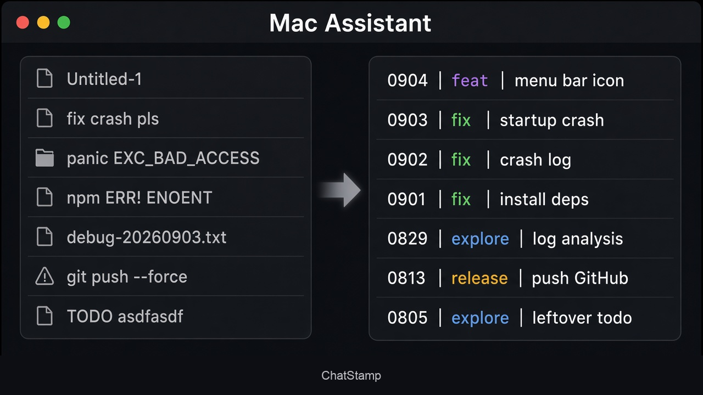
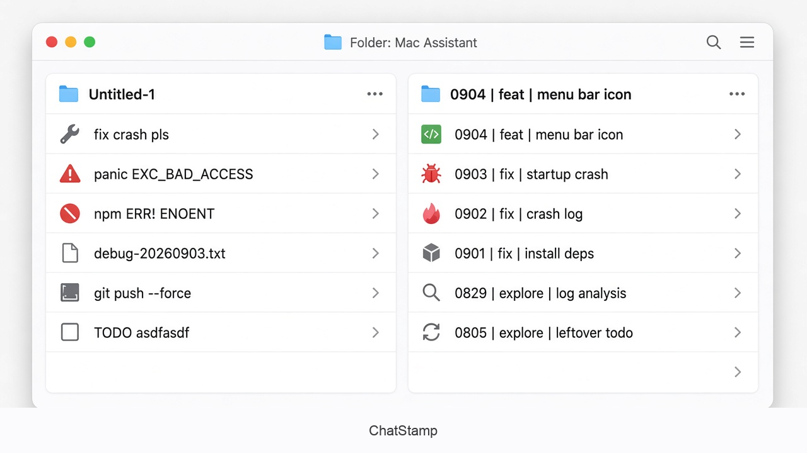

# ChatStamp

Turn messy agent chat names into scannable `date | type | topic` titles.

[中文](README.md)

Dark:

<p align="center">
  
</p>

Light:

<p align="center">
  
</p>

```
0904 | fix | inject crash     # locale=en
0904｜修复｜注入闪退          # locale=zh
```

Local skill, no cloud API. Any client that loads a local `skills` directory can use it: Cursor, Claude Code, Codex, Grok, Orca, Gemini, and others.

**Title language follows the user, not each transcript.** `locale=en` keeps every title in English, even if a chat is in Chinese.

---

## One-line install

Needs `git`, `python3` 3.9+, macOS or Linux.

English titles:

```bash
curl -fsSL https://raw.githubusercontent.com/iosrxwy/ChatStamp/main/scripts/bootstrap.sh | bash -s -- --locale en --timezone America/Los_Angeles
```

Chinese titles:

```bash
curl -fsSL https://raw.githubusercontent.com/iosrxwy/ChatStamp/main/scripts/bootstrap.sh | bash -s -- --locale zh
```

Date source: `--date-source updated` (last message, default) or `--date-source created`. A Cursor `stop` hook is merged by default; pass `--no-hooks` to skip. Existing Orca / rtk entries are left in place.

The installer clones to `~/.local/share/ChatStamp`, writes `~/.config/chat-stamp/config.json`, and links into each host `skills` folder that exists (including Orca’s isolated home, Grok, Gemini, and others).

---

## Created date vs last-updated date

The `MMDD` prefix has **one global source**. It does not change per chat.

| Value | Reads | Use when |
|-------|--------|----------|
| `updated` (default) | last message / last update | scan by “what I touched last” |
| `created` | conversation created time | archive by “the day I opened it” |

Pick it at install, say it to the agent once, or run `init` again. All three write `dateSource` in `~/.config/chat-stamp/config.json`.

```bash
./scripts/install.sh --date-source updated --locale en
./scripts/install.sh --date-source created --locale en
```

---

## Manual trigger (when it does not run by itself)

The Cursor `stop` hook (on by default) only renames the **current** chat when its title is not yet formatted. If you installed with `--no-hooks`, or want to rename other chats, trigger it yourself:

Short slash tokens (do not type a long sentence):

| Token | What it changes | Date in the title |
|-------|------------------|-------------------|
| `/tu` | this chat only | last updated time (today if you are still in it) |
| `/tc` | this chat only | created time (the day you opened it) |
| `/au` | all chats | each chat's own last-updated time |
| `/ac` | all chats | each chat's own created time |

CLI:

```bash
python3 scripts/chat_stamp.py export --host auto --out /tmp/chats.json
# write [{"id":"...","title":"0904 | fix | inject crash"}]
python3 scripts/chat_stamp.py apply --map /tmp/map.json
```

Cursor current window: call `rename_chat`, then `apply`, so the sidebar and the opened composer stay in sync. `apply` writes Cursor's SQLite directly; run it while Cursor is idle.

`--locale en` installs English slash-menu hints (`/tu` = this chat, last updated; `/au` = all chats, last updated). The Cursor stop hook is on by default and injects that same English `/tu` when the title is not formatted. Pass `--no-hooks` to skip.

If the existing title is clear, wrap it. If not, read only the assistant wrap-up with code removed. `/au` `/ac` read `~/.cursor/skills/chat-stamp/SKILL.md` and batch-apply. Export includes `titleClear`.

`locale=en` types: feat, design, fix, perf, release, explore, docs, research.

If the theme is unclear, keep the original title. Empty chats are archived. Titles only — no project move, pin, or body edits.

---

## Hook (on by default)

```bash
./scripts/install.sh --locale en            # merges the Cursor stop hook
./scripts/install.sh --locale en --no-hooks # skip it
```

Merges into existing config without replacing other entries:

- **Cursor**: `stop` in `~/.cursor/hooks.json`. If the current title is not formatted, one `/tu` follow-up renames **this** chat.
- **Claude Code**: when `~/.claude` exists, `Stop` in `~/.claude/settings.json`. The hook returns `decision: block` so Claude runs one more `/tu` turn. Once per session.
- **Codex**: `SessionEnd` is too short; it only records the id. `~/.codex/hooks.json` is not touched.

See [hooks/README.md](hooks/README.md).

---

## Manual install

```bash
git clone https://github.com/iosrxwy/ChatStamp.git
cd ChatStamp
./scripts/install.sh --date-source updated --locale en
```

Or download the GitHub ZIP, unzip, and run the same `install.sh`. Without `.git` you re-download to update.

Only one host: run `install.sh`, then delete the symlinks you do not want, e.g. `rm -f ~/.claude/skills/chat-stamp ~/.codex/skills/chat-stamp ~/.agents/skills/chat-stamp`.

No script at all:

```bash
mkdir -p ~/.cursor/skills
ln -s /path/to/chat-stamp ~/.cursor/skills/chat-stamp
python3 /path/to/chat-stamp/scripts/chat_stamp.py init --date-source updated --locale en
```

Project-level: link into `.cursor/skills/chat-stamp` or `.claude/skills/chat-stamp` inside the repo.

Cursor data is found on macOS (`~/Library/Application Support/Cursor`), Linux (`~/.config/Cursor`) and Windows (`%APPDATA%\Cursor`); set `CURSOR_USER_DATA` for a custom location.

---

## Update / uninstall

```bash
git -C ~/.local/share/ChatStamp pull --ff-only          # update; symlinks stay
~/.local/share/ChatStamp/scripts/uninstall.sh           # remove skill symlinks, keep config
~/.local/share/ChatStamp/scripts/uninstall.sh --purge   # also remove ~/.config/chat-stamp
```

Hook entries stay in `hooks.json` / `settings.json`; remove them by hand. Delete the checkout yourself.

---

## Safety

- Does not change workspace, pin, sort, or message bodies.
- Does not put secrets from transcripts into titles.
- Scripts do not upload chats.

## Inspiration

Layout idea from [AgiRay1015](https://x.com/AgiRay1015/status/2095323635603116234): messy names on the left, `date | type | topic` on the right. The images here are our own IDE mockups, not the original screenshot.

## License

MIT
