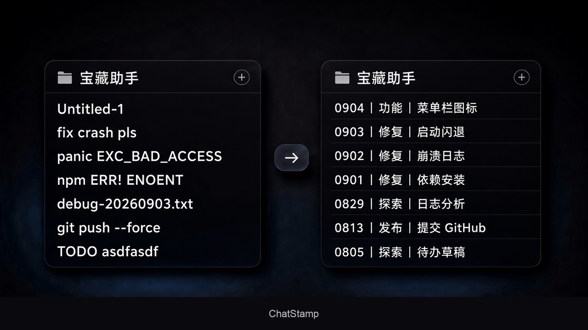
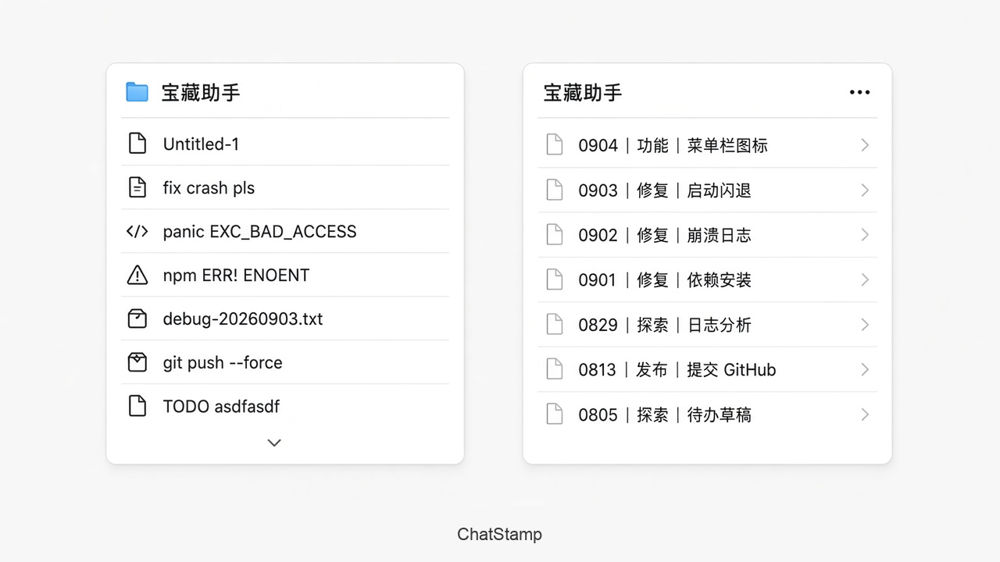

# ChatStamp

把 Agent 侧栏里看不懂的对话名，整理成能扫的「日期｜类型｜主题」。

开源：[github.com/iosrxwy/ChatStamp](https://github.com/iosrxwy/ChatStamp)　推特：[@iosrxwy](https://x.com/iosrxwy)　Telegram：[t.me/iosrxwy](https://t.me/iosrxwy/)

[English](README.en.md)

夜间：

<p align="center">
  
</p>

日间：

<p align="center">
  
</p>

```
0904｜修复｜注入闪退          # locale=zh（默认）
0904 | fix | inject crash     # locale=en
```

本机 skill，不调云端 API。凡是把 skill 链到本机 `skills` 目录的客户端都能用，例如 Cursor、Claude Code、Codex、Grok、Orca、Gemini 等。

**标题语言跟用户，不跟单条会话。** 你用中文时默认 `locale=zh`：即使某条对话全文是英文，也会总结成中文标题。

---

## 一键安装

需要：`git`、`python3` 3.9+、macOS 或 Linux。

中文标题（默认）：

```bash
curl -fsSL https://raw.githubusercontent.com/iosrxwy/ChatStamp/main/scripts/bootstrap.sh | bash -s -- --locale zh
```

英文标题：

```bash
curl -fsSL https://raw.githubusercontent.com/iosrxwy/ChatStamp/main/scripts/bootstrap.sh | bash -s -- --locale en --timezone America/Los_Angeles
```

可选日期来源：`--date-source updated`（最后一条消息，默认）或 `--date-source created`（创建时间）。

可选 Hook：默认合并一条 Cursor `stop` hook（不覆盖 Orca / rtk 已有条目）。不要 hook 用 `--no-hooks`。

一键脚本会：

1. `git clone` 到 `~/.local/share/ChatStamp`（已有则 `git pull`）
2. 写入 `~/.config/chat-stamp/config.json`
3. 软链 skill 到各端 `skills` 目录（有哪个装哪个，还包括 Orca 隔离 home、Grok、Gemini 等）
4. 软链口令 `/tu` `/tc` `/au` `/ac` 到 `~/.cursor/commands/`，并按需合并 Cursor `stop` hook

| 端 | Skill 路径 | 装完怎么生效 |
|----|------------|--------------|
| Cursor | `~/.cursor/skills/chat-stamp` | 新开一条 Agent 对话，或重载窗口 |
| Claude Code | `~/.claude/skills/chat-stamp` | 新开一轮 session |
| Codex | `~/.codex/skills/chat-stamp` | 新开 thread |
| Grok | `~/.grok/skills/chat-stamp` | 新开一轮 |
| Orca | 其隔离 Codex home 下的 `skills/chat-stamp` | 新开智能体 |
| 其它 Agent 等 | `~/.agents/skills/chat-stamp` | 视客户端而定 |

不信任 `curl | bash` 就用下面的手动安装。

---

## 手动下载 / 安装

### Git clone

```bash
git clone https://github.com/iosrxwy/ChatStamp.git
cd ChatStamp
chmod +x scripts/install.sh
./scripts/install.sh --date-source updated --locale zh
```

### GitHub ZIP

1. 打开 [iosrxwy/ChatStamp](https://github.com/iosrxwy/ChatStamp)
2. `Code` → `Download ZIP`
3. 解压后进入目录，执行同一条 `./scripts/install.sh ...`

ZIP 没有 `.git`，以后更新要重新下载，或改成 `git clone`。

### 只装某一个端

`install.sh` 固定链到 Cursor / Claude Code / Codex / `~/.agents` 四个目录，Grok、Gemini、Orca 目录存在时也会链。若只想给 Cursor 用，装完后删掉其余软链即可：

```bash
rm -f ~/.claude/skills/chat-stamp ~/.codex/skills/chat-stamp ~/.agents/skills/chat-stamp \
      ~/.grok/skills/chat-stamp ~/.gemini/skills/chat-stamp
```

也可以不跑脚本，自己软链：

```bash
mkdir -p ~/.cursor/skills
ln -s /path/to/chat-stamp ~/.cursor/skills/chat-stamp
python3 /path/to/chat-stamp/scripts/chat_stamp.py init --date-source updated --locale zh
```

### 某个仓库内的项目级 skill

只想在一个项目里用，不要全局：

```bash
mkdir -p .cursor/skills
ln -s /path/to/chat-stamp .cursor/skills/chat-stamp
```

Claude Code 同理：链到项目下的 `.claude/skills/chat-stamp`。

---

## 日期用创建时间还是最近对话时间

标题最前面的 `MMDD` 只有一个来源，**全局选一次**，不会按某条会话自己变。

| 你选的值 | 日期取自 | 适合 |
|----------|----------|------|
| `updated`（默认） | 最后一条消息 / 最后更新 | 侧栏按「最近在做的事」扫 |
| `created` | 会话创建时间 | 侧栏按「哪天开的工」归档 |

三种选法，效果一样，都会写入 `~/.config/chat-stamp/config.json` 的 `dateSource`：

1. **安装时带参数**（推荐）

```bash
./scripts/install.sh --date-source updated --locale zh
# 或
./scripts/install.sh --date-source created --locale zh
```

2. **打口令**（日期写在口令里，不必再问）

`/tu` 最近 · `/tc` 创建 · `/au` 全部最近 · `/ac` 全部创建

3. **以后改主意**，再跑一次 init，或直接改配置：

```bash
python3 ~/.local/share/ChatStamp/scripts/chat_stamp.py init --date-source created --locale zh
```

时区默认 `Asia/Shanghai`，安装时可用 `--timezone`。

---

## 配置

`~/.config/chat-stamp/config.json`（例子见 [config.example.json](config.example.json)）：

| 字段 | 含义 | 默认 |
|------|------|------|
| `locale` | 标题语言 `zh` / `en`，全局一份，不按会话变 | `zh` |
| `dateSource` | `updated`（最近）或 `created`（创建） | `updated` |
| `timezone` | IANA 时区 | `Asia/Shanghai` |

---

## 怎么触发

| 口令 | 改谁 | 标题里的日期 |
|------|------|----------------|
| `/tu` | 只改当前这条 | 这条的最后更新时间（还在聊就用今天） |
| `/tc` | 只改当前这条 | 这条的创建时间（哪天开的这条用哪天） |
| `/au` | 全部对话 | 各条用自己的最后更新时间 |
| `/ac` | 全部对话 | 各条用自己的创建时间 |

斜杠菜单里的那句话跟 `locale` 走：中文用户看中文，`--locale en` 看英文。不要打长句。现成标题能看懂就套格式；看不懂或语言不符，看用户消息和 AI 回复总结（去代码）。`/au` `/ac` 读 `~/.cursor/skills/chat-stamp/SKILL.md` 后批量处理。

Cursor **stop hook 默认已开**：每条未格式化的对话最多跟一轮短 `/tu`（`rename_chat`）。现成标题能套格式时 followup 里直接带上成品标题；看不懂或语言不符时让模型看对话。Cursor 会同时跑 Claude 的 Stop，那种会跳过。不要 hook 用 `--no-hooks`。

Codex 若已有自己的自动标题 hook，安装**不会**再插一条，避免重复。不覆盖 Orca / rtk 的 hooks。

命令行：

```bash
python3 scripts/chat_stamp.py export --host auto --out /tmp/chats.json
# 按正文写一份 [{"id":"...","title":"0904｜修复｜注入闪退"}]
python3 scripts/chat_stamp.py apply --map /tmp/map.json
```

Cursor 当前窗口：先 `rename_chat`，再跑一次 `apply`，避免侧栏和点进去各显示一个名字。`apply` 直接写 Cursor 的 SQLite，建议 Cursor 空闲时执行。

批量时 Agent 读安装路径下的 `SKILL.md`，`export` 会带 `titleClear`、`snippet`（AI 总结，已去代码）和 `userSnippet`（用户消息前若干条，去路径/去代码，≤400 字）。Cursor 的 FTS 正文无法区分角色，所以 `userSnippet` 可能含双方文本。

`locale=zh` 类型：功能、设计、修复、优化、发布、探索、文档、研究。

`locale=en` 类型：feat, design, fix, perf, release, explore, docs, research。

无法判断主题时保留原名，不换模型、不改语言。正文几乎为空则归档。不改项目名、正文、归属、排序、置顶。`apply` 会拒绝和用户 locale 不符的标题。

---

## 更新

一键安装过的：

```bash
curl -fsSL https://raw.githubusercontent.com/iosrxwy/ChatStamp/main/scripts/bootstrap.sh | bash -s -- --locale zh
```

或：

```bash
git -C ~/.local/share/ChatStamp pull --ff-only
```

软链还在，不用重装。手动 clone 的在仓库目录里 `git pull`。

---

## 卸载

```bash
# 只去掉各端 skill 软链，保留配置和仓库
~/.local/share/ChatStamp/scripts/uninstall.sh

# 连配置一起删
~/.local/share/ChatStamp/scripts/uninstall.sh --purge
```

Hook 条目需要你自己从 `hooks.json` / `settings.json` 里删。仓库目录（`~/.local/share/ChatStamp` 或你 clone 的路径）要删自己 `rm -rf`。

---

## Hook：会话结束自动改当前标题（默认开）

```bash
./scripts/install.sh --locale zh            # 默认合并 hook
./scripts/install.sh --locale zh --no-hooks # 不要 hook
```

会把 hook 片段**合并进**现有配置，不覆盖其它条目：

- **Cursor**：`~/.cursor/hooks.json` 的 `stop`。一条短 followup + `rename_chat`，每个会话最多一次。单独写 SQLite 改不了当前侧栏。
- **Claude Code**：`~/.claude` 存在时合并 `Stop`。若 id 是 Cursor 对话则跳过；否则能套格式就写 overrides，不能就一次 `block`。
- **Codex**：`SessionEnd` 太短，只记下 id，标题仍由 skill 来写；脚本不改 `~/.codex/hooks.json`。

详见 [hooks/README.md](hooks/README.md)。

---

## 命令行（Agent 或你自己）

```bash
python3 scripts/chat_stamp.py init --date-source updated --locale zh
python3 scripts/chat_stamp.py export --host auto --out /tmp/chats.json
python3 scripts/chat_stamp.py apply --map /tmp/map.json
python3 scripts/chat_stamp.py archive-empty --host auto
```

`--host`：`auto` / `cursor` / `claude` / `codex` / `orca` / `grok`（Cursor 里的 Grok 走 Cursor 存储）等。脚本认得出的端会写对应标题；认不出的端只要客户端读了 `SKILL.md`，仍可按同一规则改名。

| 端 | 标题写到哪 |
|----|------------|
| Cursor / Grok | `composerHeaders.name` + `composerData.name` + 搜索库 `title` |
| Codex | `~/.codex/session_index.jsonl` 的 `thread_name` |
| Claude Code | `~/.claude/chat-stamp-overrides.json`（侧栏是否立即显示取决于客户端） |
| Orca / Grok TUI | Grok `summary.json`（钉 `title_is_manual`）+ session cache + `orca terminal rename`（左边项目列表的 `customTitle`） |

Cursor 对话库自动在 macOS（`~/Library/Application Support/Cursor`）、Linux（`~/.config/Cursor`）、Windows（`%APPDATA%\Cursor`）之间查找；路径特殊时设 `CURSOR_USER_DATA` 指向 Cursor 的用户数据目录。

---

## 安全

- 不改 workspace、置顶、排序、消息正文。
- 不把 transcript 里的密钥写进标题。
- 脚本不请求网络、不上传对话。
- `bootstrap.sh` / `install.sh` 只写本机 skill 软链和 `~/.config/chat-stamp`。

## 灵感

构图思路来自 [AgiRay1015](https://x.com/AgiRay1015/status/2095323635603116234) 的侧栏对比：左边一句口语，右边变成可扫的 `日期｜类型｜主题`。README 配图是我们按同一思路自己画的 IDE 界面，不是原帖截图。

## License

MIT
